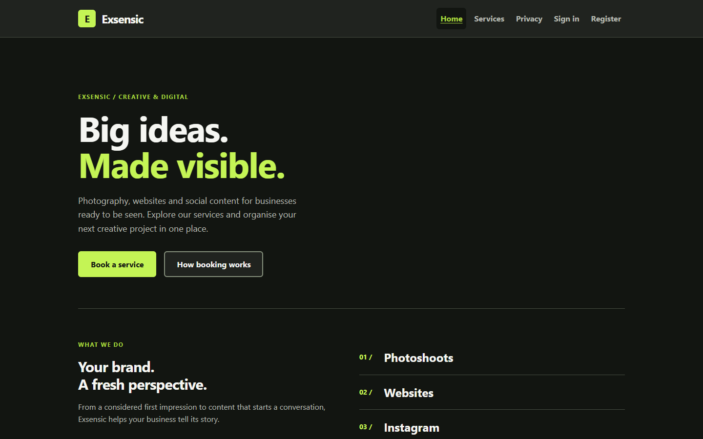
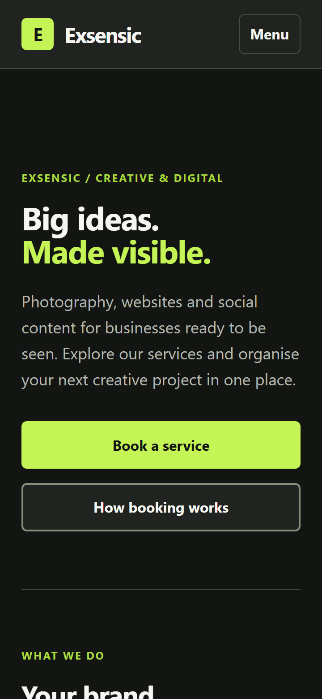
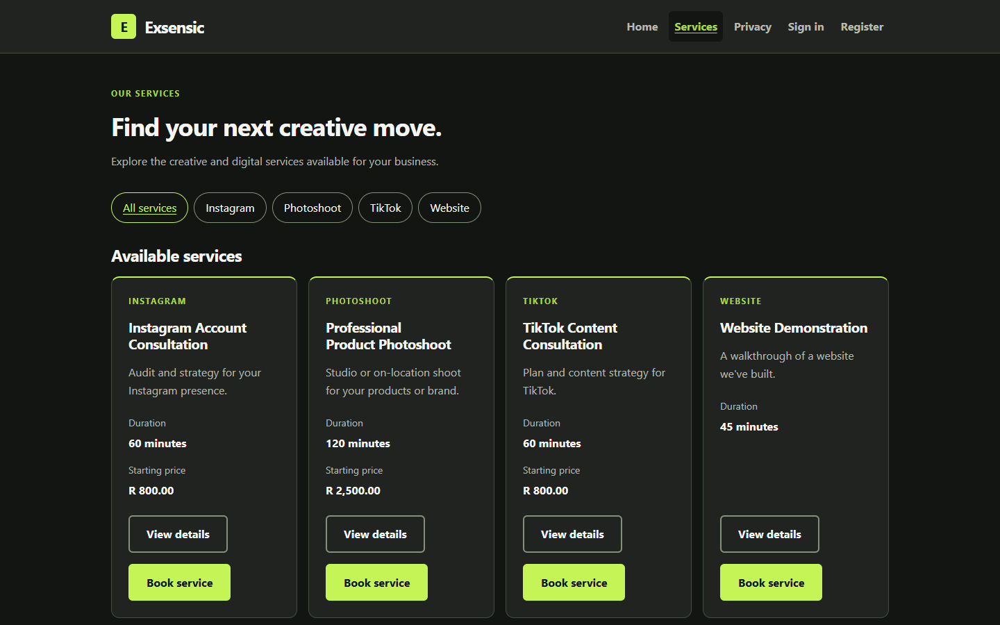
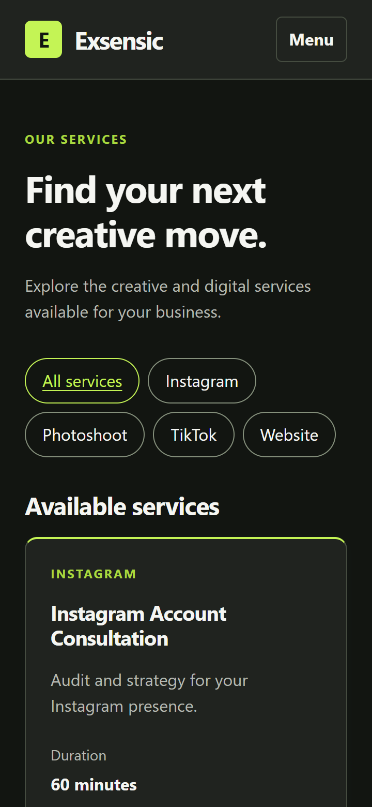
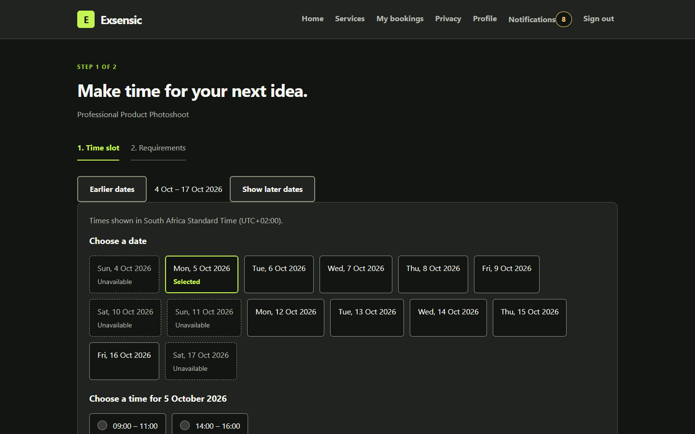
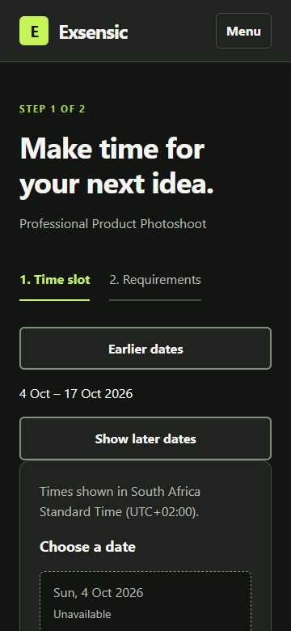
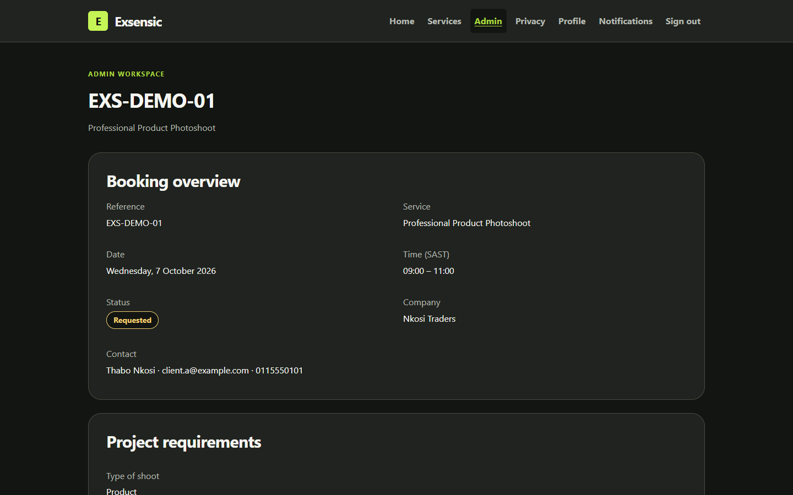
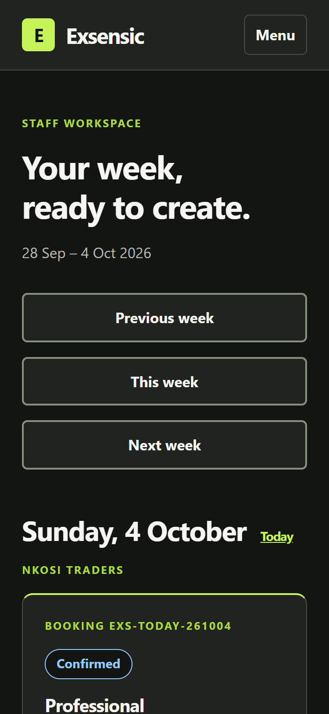
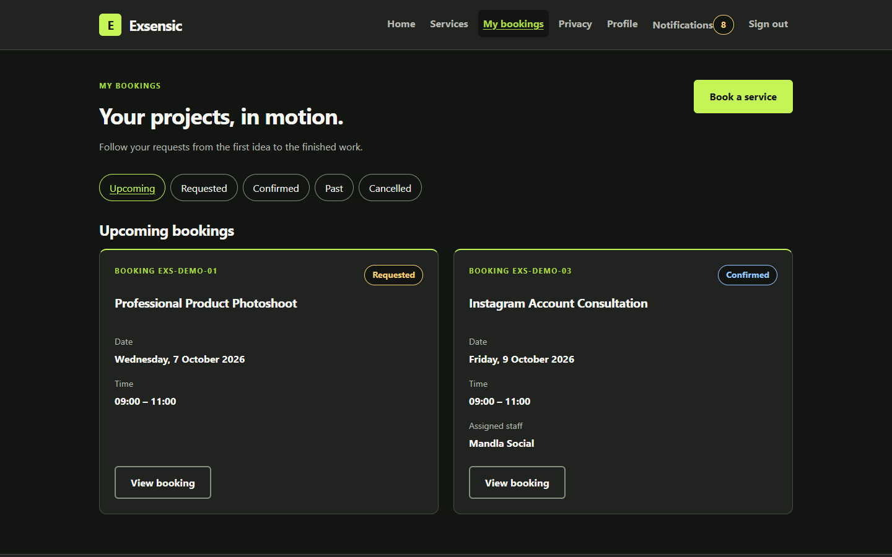
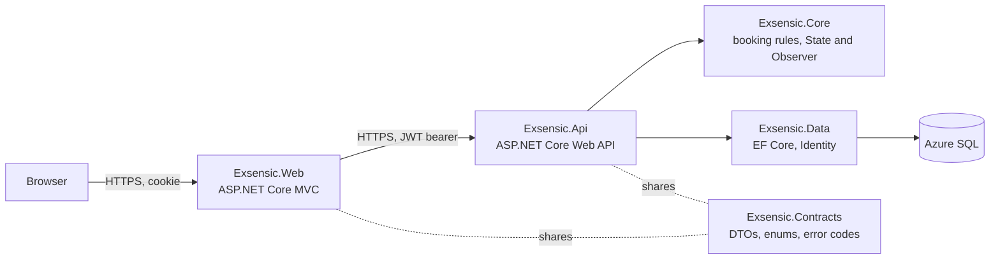

<div align="center">

  

  <h1>Exsensic Booking and Service Management System</h1>

  <p>
    Photography, websites and social content for businesses, booked, approved and delivered in one place.
  </p>

<p>
  <a href="https://github.com/Josh0123456/exsensic-insy7315/actions/workflows/ci.yml"></a>
  <a href="https://github.com/Josh0123456/exsensic-insy7315/actions/workflows/cd-staging.yml"></a>
  <a href="https://github.com/Josh0123456/exsensic-insy7315/actions/workflows/cd-production.yml"></a>
  
  
</p>

<h4>
  <a href="https://app-exsensic-web.azurewebsites.net">Live site</a>
  <span> · </span>
  <a href="https://app-exsensic-web-staging.azurewebsites.net">Staging</a>
  <span> · </span>
  <a href="#demo-video-and-presentation">Demo video</a>
  <span> · </span>
  <a href="docs/architecture.md">Architecture</a>
  <span> · </span>
  <a href="docs/operations.md">Operations</a>
</h4>
</div>

<br />

## Table of contents

- [About the project](#about-the-project)
  - [Live links and demo access](#live-links-and-demo-access)
  - [Screenshots](#screenshots)
  - [Features](#features)
  - [Tech stack](#tech-stack)
  - [Architecture](#architecture)
  - [Colour reference](#colour-reference)
- [Hosting](#hosting)
- [Getting started](#getting-started)
  - [Prerequisites](#prerequisites)
  - [Configuration and environment variables](#configuration-and-environment-variables)
  - [Run locally](#run-locally)
  - [Running tests](#running-tests)
- [Branching, CI and CD](#branching-ci-and-cd)
- [Documentation](#documentation)
- [Demo video and presentation](#demo-video-and-presentation)
- [Team](#team)
- [References](#references)

## About the project

Exsensic is a creative and digital agency. Its clients used to book photoshoots and consultations by
email and phone. This system replaces that with one web application: **clients** browse the services,
pick an available time and send their brief; **admins** approve each request and assign a qualified,
free staff member; **staff** see their week and mark work as completed. Every status change is recorded
and notifies the people involved.

It is built for INSY7315 (Work Integrated Learning), Task 2, as an ASP.NET Core MVC front end that calls a
separate ASP.NET Core Web API, hosted on Azure with automated testing and deployment.

### Live links and demo access

| Environment | Website | Purpose |
|---|---|---|
| Production | https://app-exsensic-web.azurewebsites.net | The live system used for the demo and marking |
| Staging | https://app-exsensic-web-staging.azurewebsites.net | Every merge to `develop` is deployed and tested here first |

**Demo accounts** (one client, one staff member, one admin) are provided in the **ARC submission
comment**, never in this repository. The API is not reachable from the internet directly; it only accepts
calls from the website (see [Hosting](#hosting)).

> The databases use Azure SQL's free tier, which pauses when idle. If the first page takes a few seconds,
> it is waking up; open the site a minute before a demo.

### Screenshots

| Desktop | Mobile (360 px) |
|---|---|
|  |  |
|  |  |
|  |  |
|  |  |
|  | |

### Features

**Clients**
- Register, sign in and manage their profile
- Browse the service catalogue by category
- Book in two steps: choose a free time slot, then fill in a brief built from the service's requirement template
- See their bookings by tab (Upcoming, Requested, Confirmed, Past, Cancelled) with a full status timeline
- Reschedule or cancel (cancellation closes 24 hours before the start)
- In-app notifications with an unread badge

**Admins**
- Dashboard with counts per status, the approval queue and the coming week
- Filter and page through all bookings
- Confirm a request with a staff member who is qualified for the service and free at that time, or reject it with a reason

**Staff**
- Weekly schedule with today highlighted
- Booking details with everything needed to prepare
- Mark a booking as completed once its time has started

**Built in**
- A booking can never be double-booked: a filtered unique index in the database is the final guarantee, proven by a test that sends 20 requests for one slot at once
- Booking status only changes through the **State pattern**; every change is recorded by the **Observer pattern** (history and notifications)
- Another user's booking always returns "not found" (never revealing that it exists)
- Security headers with a strict Content Security Policy, rate-limited sign-in and registration, and account lockout

### Tech stack

<details>
  <summary>Front end</summary>
  <ul>
    <li>ASP.NET Core MVC (.NET 10) with Razor views and tag helpers</li>
    <li>Custom design tokens and CSS (no inline styles or scripts), Bootstrap for layout helpers</li>
  </ul>
</details>

<details>
  <summary>Back end</summary>
  <ul>
    <li>ASP.NET Core Web API (.NET 10) with controllers and ProblemDetails errors</li>
    <li>ASP.NET Core Identity and JWT bearer tokens, role and resource-based authorisation</li>
    <li>Entity Framework Core 10 with migrations</li>
  </ul>
</details>

<details>
  <summary>Database</summary>
  <ul>
    <li>Azure SQL Database (free offer, serverless); SQL Server LocalDB for local development</li>
  </ul>
</details>

<details>
  <summary>Testing</summary>
  <ul>
    <li>xUnit and NSubstitute (unit), WebApplicationFactory against SQL Server (integration)</li>
    <li>Playwright for .NET (end-to-end, against the deployed staging site)</li>
  </ul>
</details>

<details>
  <summary>DevOps and hosting</summary>
  <ul>
    <li>GitHub Actions: <code>ci</code>, <code>cd-staging</code> (with end-to-end tests) and <code>cd-production</code> (with an approval gate)</li>
    <li>Azure App Service (Linux, B1), Azure SQL, deployment through OpenID Connect with a managed identity (no stored passwords)</li>
  </ul>
</details>

### Architecture



- **Web never touches the database or the business rules.** It talks to the API over HTTPS only, using
  the shared DTOs in `Exsensic.Contracts`.
- **Core holds the business rules** and does not depend on the Data project or on ASP.NET Core; it uses an
  `IAppDbContext` interface that Data implements.
- These layer rules are **enforced by architecture tests** in CI (`tests/Exsensic.UnitTests/Architecture`).

The full design, including the State and Observer patterns, the booking-creation sequence and the
transition table, is in [docs/architecture.md](docs/architecture.md). Every shared name, route and error
code is fixed in [docs/CONTRACTS.md](docs/CONTRACTS.md).

### Colour reference

Taken from `src/Exsensic.Web/wwwroot/css/tokens.css`.

| Token | Colour | Hex | Used for |
|---|---|---|---|
| `--brand` |  | `#c4f455` | Primary buttons, brand mark, highlights |
| `--surface-alt` |  | `#121511` | Page background |
| `--surface` |  | `#20231f` | Cards and panels |
| `--ink` |  | `#f5f6f2` | Main text |
| `--ink-muted` |  | `#b5b9b1` | Secondary text |
| `--status-requested` |  | `#f5ce72` | Requested badge |
| `--status-confirmed` |  | `#94caff` | Confirmed badge |
| `--status-completed` |  | `#7fe0a7` | Completed badge |
| `--status-cancelled` |  | `#ff9eaa` | Cancelled badge |

Status is never shown by colour alone: every badge also shows the status word.

## Hosting

| Resource | Name | Notes |
|---|---|---|
| App Service plan | `asp-exsensic` | Linux, **B1**, one plan for all four apps |
| Production web / API | `app-exsensic-web` / `app-exsensic-api` | Deployed from `main` after approval |
| Staging web / API | `app-exsensic-web-staging` / `app-exsensic-api-staging` | Deployed from every merge to `develop` |
| Databases | `sqldb-exsensic-prod` / `sqldb-exsensic-staging` on `sql-exsensic` | Azure SQL free offer, serverless |
| Deploy identity | `id-exsensic-deploy` | GitHub signs in through OpenID Connect; can only deploy web apps in this resource group |

**Why Azure.** The system is .NET end to end, and the Part 1 deployment design already used Azure.
App Service runs ASP.NET Core with no containers to manage, and GitHub Actions deploys to it with a
managed identity instead of stored passwords.

**Why one B1 plan (hosting option 1).** Four apps on one Basic plan cost about **US$13 a month**; both
databases use the **free offer**, so the whole system runs for about **US$13–15 a month**
([Azure pricing calculator](https://azure.microsoft.com/pricing/calculator/)). The trade-offs, accepted
on purpose for a student budget:
- **No deployment slots** (Standard tier): a deploy briefly restarts the app instead of swapping in a warm copy.
- **Cold starts:** the free database pauses when idle and takes up to a minute to resume.
- **No private network:** the Part 1 design used a virtual network and private endpoint, which need a
  more expensive tier. Instead, the **API only accepts traffic from the website's outbound IP addresses**
  (App Service access restrictions), so it is not reachable from the internet directly.
- **Region:** UAE North, the closest region to South Africa that the Azure for Students subscription allows.

Settings and secrets live in App Service configuration (encrypted at rest, never in Git). Health checks
run on `/health` (the app is up) and `/health/ready` (the API can reach its database). Deployment,
rollback, logs and limits are documented in [docs/operations.md](docs/operations.md).

## Getting started

### Prerequisites

- [.NET 10 SDK](https://dotnet.microsoft.com/download) (version pinned in `global.json`)
- SQL Server LocalDB (installed with Visual Studio's "Data storage and processing" workload) or any SQL Server
- Visual Studio 2026, VS Code or Rider
- Optional: `dotnet tool install --global dotnet-ef` to work with migrations
- Optional, for end-to-end tests: PowerShell 7 (`pwsh`) to install the Playwright browser

### Configuration and environment variables

Settings use the names below (docs/CONTRACTS.md §9). **Values never go in Git**: use
`dotnet user-secrets` locally and App Service settings in Azure.

**API** (`src/Exsensic.Api`)

| Setting | Secret | Purpose |
|---|---|---|
| `ConnectionStrings:Default` | yes | SQL Server connection string |
| `Jwt:SigningKey` | yes | At least 32 characters; signs access tokens |
| `Jwt:Issuer`, `Jwt:Audience`, `Jwt:LifetimeMinutes` | no | In `appsettings.json` |
| `Seed:AdminEmail`, `Seed:AdminPassword` | yes | The first admin account |
| `Seed:DemoPassword` | yes | Password for the demo staff and clients |
| `Database:MigrateOnStartup` | no | `true` in Azure: apply migrations and seed at start-up |
| `Database:SeedDemoData` | no | Adds demo data outside Development and Staging (production demo) |

**Web** (`src/Exsensic.Web`)

| Setting | Secret | Purpose |
|---|---|---|
| `Api:BaseUrl` | no | The API's root URL: `https://localhost:7184/` locally, the API app's URL in Azure |

**GitHub Actions** (names only): `AZURE_CLIENT_ID`, `AZURE_TENANT_ID`, `AZURE_SUBSCRIPTION_ID`, the six
`E2E_*` demo-account secrets, and the variables `STAGING_DEPLOY_ENABLED`, `E2E_ENABLED`,
`PRODUCTION_DEPLOY_ENABLED` and `PRODUCTION_APPROVERS`.

### Run locally

Clone the project and restore it:

```bash
git clone https://github.com/Josh0123456/exsensic-insy7315.git
cd exsensic-insy7315
dotnet restore
```

Set the API's secrets (replace the placeholders with your own values):

```bash
cd src/Exsensic.Api
dotnet user-secrets set "ConnectionStrings:Default" "Server=(localdb)\\MSSQLLocalDB;Database=ExsensicDev;Trusted_Connection=True;TrustServerCertificate=True"
dotnet user-secrets set "Jwt:SigningKey" "<at-least-32-random-characters>"
dotnet user-secrets set "Seed:AdminEmail" "<admin-email>"
dotnet user-secrets set "Seed:AdminPassword" "<10+ chars, upper, lower and a digit>"
dotnet user-secrets set "Seed:DemoPassword" "<10+ chars, upper, lower and a digit>"
```

Start the API, then the website in a second terminal (use the `https` launch profile). In Development
the API creates the database, applies the migrations and adds the demo data on start-up.

```bash
dotnet run --project src/Exsensic.Api --launch-profile https
dotnet run --project src/Exsensic.Web --launch-profile https
```

Open https://localhost:7005. The website already points at the API on https://localhost:7184
(`Api:BaseUrl` in `src/Exsensic.Web/appsettings.Development.json`).

### Running tests

```bash
dotnet test
```

This runs the **unit tests** (booking rules, state transitions, requirement validation, observers and the
architecture rules) and the **integration tests** (the API end to end against SQL Server, including the
20-request double-booking test).

The **end-to-end tests** drive a real browser against a deployed site. They only run when `E2E_BASE_URL`
is set; in the pipeline they run after every staging deployment.

```bash
pwsh tests/Exsensic.E2ETests/bin/Debug/net10.0/playwright.ps1 install chromium
```

## Branching, CI and CD

| Branch | Purpose |
|---|---|
| `main` | Production. Only release merges from `develop` |
| `develop` | Integration branch and default branch; every pull request targets it |
| `feat/pN-…`, `fix/pN-…`, `test/pN-…`, `ci/pN-…`, `docs/pN-…` | Short-lived branches, one card step or small group of steps, `pN` = person number |

- Commit messages follow `type(scope): description` (lowercase, imperative, under 72 characters) with
  bullet points in the body ([CONTRIBUTING.md](CONTRIBUTING.md)).
- Pull requests use the [PR template](.github/pull_request_template.md) and merge with **merge commits**,
  never squash or rebase, so each member's commits stay visible.
- In the final 24 hours before submission, small fixes were merged by their authors after a green CI run
  to meet the deadline; this is announced on each pull request.

| Workflow | Runs on | What it does |
|---|---|---|
| [`ci`](.github/workflows/ci.yml) | Every push and pull request | Build, unit and integration tests (SQL Server in a container), vulnerable-package check, secret scan |
| [`cd-staging`](.github/workflows/cd-staging.yml) | Merge to `develop` | Unit tests, publish, deploy API then web, smoke test, **Playwright end-to-end tests** |
| [`cd-production`](.github/workflows/cd-production.yml) | Merge to `main` | The same build, then **waits for a second team member to approve** in a GitHub issue before deploying |

Examples: <!-- add links -->[a feature pull request](https://github.com/Josh0123456/exsensic-insy7315/pull/24) ·
[a staging run](https://github.com/Josh0123456/exsensic-insy7315/actions/workflows/cd-staging.yml) ·
[the production release](https://github.com/Josh0123456/exsensic-insy7315/actions/workflows/cd-production.yml)

## Documentation

| Document | Contents |
|---|---|
| [docs/CONTRACTS.md](docs/CONTRACTS.md) | Every shared name, route, error code and setting |
| [docs/CONTRACTS.md §12](docs/CONTRACTS.md#12-decisions-that-change-the-part-1-design) | Decisions that change the Part 1 design |
| [docs/architecture.md](docs/architecture.md) | Layers, State and Observer patterns, booking-creation sequence, error handling |
| [docs/operations.md](docs/operations.md) | Azure resources, settings, deployment, rollback, logs and limits |
| docs/security.md | OWASP Top 10 mapping, auth flow and security tests *(in progress)* |
| docs/accessibility.md | Accessibility and responsive testing evidence *(in progress)* |
| [CONTRIBUTING.md](CONTRIBUTING.md) | Team rules: ownership, branching and commit format |

## Demo video and presentation

- **Backup demo video:** *link to be added*
- **Presentation deck:** *link to be added*

## Team

| Member | Student number | Role | Work |
|---|---|---|---|
| Christopher Doyle | ST10445478 | Front end, UX and accessibility; demo director | [Pull requests](https://github.com/Josh0123456/exsensic-insy7315/pulls?q=is%3Apr+author%3AChristopher-Doyle) |
| Daniel Wilson | ST10446445 | Back-end API and business logic | [Pull requests](https://github.com/Josh0123456/exsensic-insy7315/pulls?q=is%3Apr+author%3AST10446445) |
| Dean Sibley | ST10440750 | Database, security and repository governance | [Commits](https://github.com/Josh0123456/exsensic-insy7315/commits/develop?author=SibleyDean) |
| Josh Stockwell | ST10440989 | DevOps, hosting, repository owner and release | [Pull requests](https://github.com/Josh0123456/exsensic-insy7315/pulls?q=is%3Apr+author%3AJosh0123456) |

## References

Code adapted from external sources is marked in the code with `// Adapted from [n]`.

1. Refactoring.Guru (n.d.) *State*. Available at: https://refactoring.guru/design-patterns/state
2. Refactoring.Guru (n.d.) *Observer*. Available at: https://refactoring.guru/design-patterns/observer
3. Microsoft (2025) *Handle errors in ASP.NET Core APIs*. Available at: https://learn.microsoft.com/aspnet/core/fundamentals/error-handling-api
