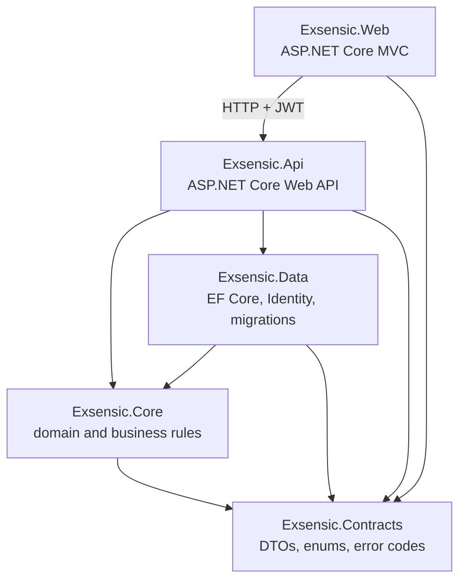
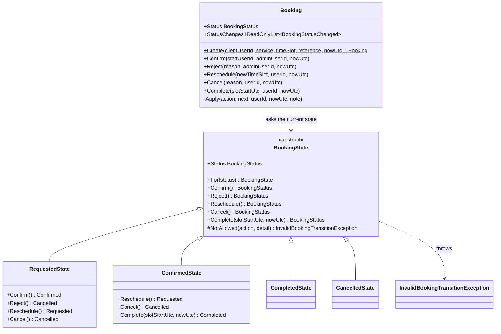
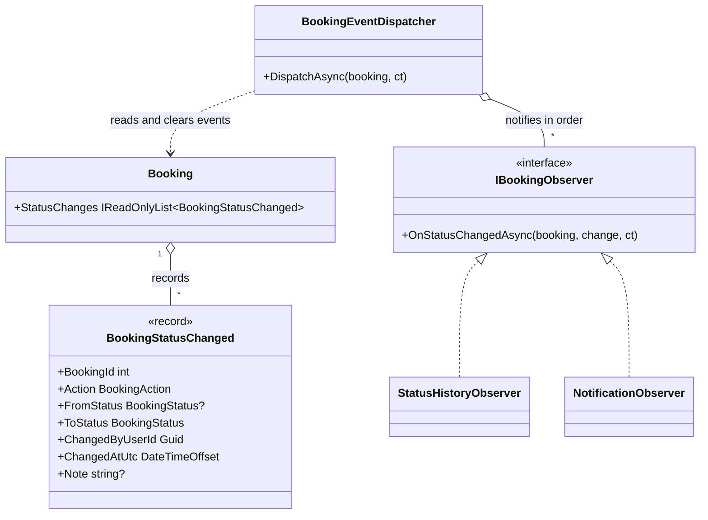
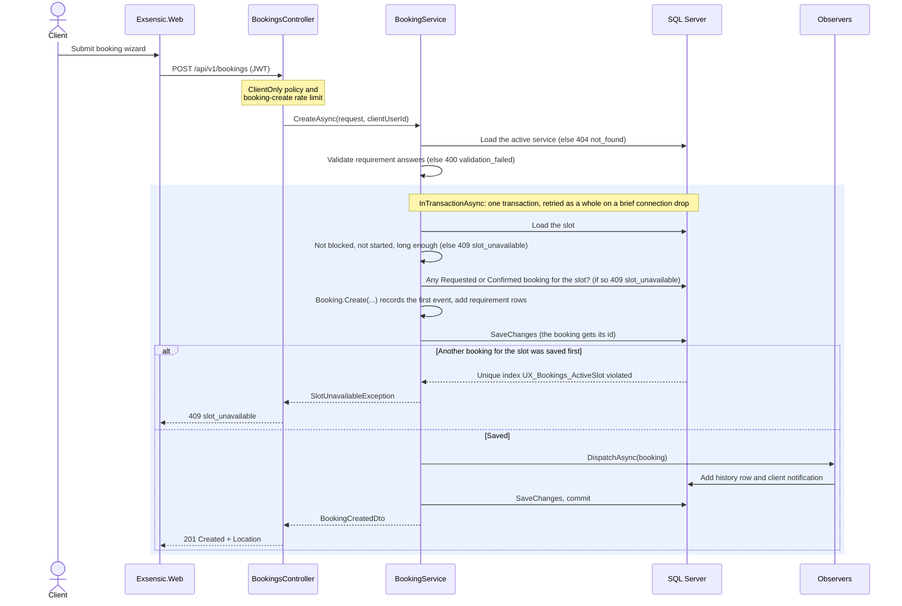

# Architecture and design patterns — Exsensic

How the solution is layered, how a booking's status is controlled, how changes reach the history and
notifications, how double-booking is prevented, and how errors reach the client.
Owner: Daniel (P2). Names follow docs/CONTRACTS.md exactly.

## 1. Layered structure

The solution has five projects in `src/` and three in `tests/` (docs/CONTRACTS.md §1). Each layer may
only reference the layers below it, so business rules can't leak into the web front end and the domain
never depends on the database.

| Project | Responsibility | May reference |
|---|---|---|
| `Exsensic.Web` | Screens. Talks to the API over HTTP only | Contracts |
| `Exsensic.Api` | Thin controllers, authentication, error handling | Core, Data, Contracts |
| `Exsensic.Core` | Booking rules: State and Observer patterns, validation, services | Contracts |
| `Exsensic.Data` | `ExsensicDbContext`, configurations, migrations, seed | Core, Contracts |
| `Exsensic.Contracts` | The shared names: DTOs, enums, `ErrorCodes` | nothing |

**Proof:** `tests/Exsensic.UnitTests/Architecture/ProjectReferenceTests.cs` reads every `src/*.csproj`
and fails CI if a project gains a reference that isn't in the table above.

Core reaches outside itself only through interfaces it owns, which the outer layers implement. This is
dependency inversion: Core states what it needs, and the API wires in the real implementation at start-up,
so Core's rules can be tested without SQL Server or Identity.

| Interface (in Core) | What Core needs | Implemented by |
|---|---|---|
| `IAppDbContext` | The tables, `SaveChangesAsync` and `InTransactionAsync` | `ExsensicDbContext` (Data) |
| `IUserDirectory` | People's names, emails and whether their account is active | `UserDirectory` (Api, reads Identity) |
| `TimeProvider` (.NET) | "Now", so time rules can be tested with a moving clock | `TimeProvider.System`, or `TestClock` in tests |

Controllers are thin: they check the caller's role and access, call one Core service, and return the
result. The booking services are split by who uses them:

| Core service | Used for |
|---|---|
| `BookingService` | Client actions: create, reschedule, cancel |
| `AdminBookingService` | Admin decisions: confirm with a staff member, reject |
| `StaffBookingService` | Staff action: complete |
| `BookingQueryService` | Every read: lists, details, staff schedule, dashboard, staff options |
| `NotificationService` | The user's notifications and marking them read |
| `RequirementTemplateService` | The requirement form for a service |

## 2. The State pattern: booking status

### Why a pattern

A booking can be in one of four statuses, and each status allows different actions. Written as
`if`/`switch` statements in every service method, these rules would be repeated and easy to get wrong.
The State pattern puts each status's rules in one class, so the full rule set for a status can be read
in one place and a new rule is added in exactly one file.

### The classes

The states are in `src/Exsensic.Core/Bookings/States/`. `Booking` is a partial class (docs/CONTRACTS.md
§12, decision 13): its properties are in `Core/Entities/Booking.cs` (Dean) and its behaviour in
`Core/Bookings/Booking.Behaviour.cs` (Daniel), so two owners never edit the same file.

- **Safe by default.** Every action on `BookingState` throws `InvalidBookingTransitionException`. A
  status allows only the actions its subclass overrides, so a forgotten case is refused instead of
  silently allowed.
- **Final statuses override nothing.** `CompletedState` and `CancelledState` are empty subclasses, so
  every action on them is refused.
- **States decide; the booking applies.** Each state method only returns the next status. The booking's
  behaviour method asks its current state, then calls its private `Apply`, which sets the status, updates
  `UpdatedAtUtc` and records one `BookingStatusChanged` event. `Apply` is the only place in the whole
  system where `Status` is set.
- **One way in.** Every booking the API creates goes through the `Booking.Create` factory, so it starts
  as Requested with its first event recorded.
- **No data, one instance each.** States hold no fields, so `BookingState.For(status)` returns a shared
  instance for the booking's current status.

### Transition table

The same table as docs/CONTRACTS.md §3. ✗ means `InvalidBookingTransitionException`, which the API
returns as `409 invalid_transition`.

| From | Confirm | Reject | Reschedule | Cancel | Complete |
|---|---|---|---|---|---|
| Requested | → Confirmed | → Cancelled | stays Requested | → Cancelled | ✗ |
| Confirmed | ✗ | ✗ | → Requested | → Cancelled | → Completed, only after the slot starts |
| Completed | ✗ | ✗ | ✗ | ✗ | ✗ |
| Cancelled | ✗ | ✗ | ✗ | ✗ | ✗ |

The other booking rules sit around the state, where they belong:

| Rule | Where |
|---|---|
| Who may act (owner client, assigned staff, admin) | The API's role checks and the `BookingAccess` policy, before Core is called |
| A rejection needs a reason, stored as `"Rejected: …"` | `Booking.Reject` |
| Rescheduling a confirmed booking keeps the proposed staff member | `Booking.Reschedule` |
| Clients can't cancel a confirmed booking within `BookingPolicy:ClientCancelCutoffHours` (24) | `BookingService.CancelAsync` (admins may cancel any time) |
| The staff member must be qualified, active and free | `AdminBookingService.ConfirmAsync`, using `StaffAvailability` |

**Proof:** `tests/Exsensic.UnitTests/Bookings/BookingStateTests.cs` (every cell, at the state level) and
`BookingTransitionMatrixTests.cs` (every cell through the `Booking` entity: allowed cells change the status
and record exactly one event; forbidden cells throw and leave the booking untouched).

## 3. The Observer pattern: history and notifications

### Why a pattern

Every booking change must also write an audit row and tell the right people. If the booking or the
services did this directly, each action would repeat the same code, and adding a new reaction (for
example email) would mean editing every action. With the Observer pattern the booking only records what
happened, and each observer decides what to do about it.

### The classes

All code is in `src/Exsensic.Core/Bookings/Observers/`.

- **The subject records, it doesn't call.** Each successful action adds a `BookingStatusChanged` event to
  the booking. The booking has no idea who is listening.
- **One dispatcher.** `BookingEventDispatcher` hands every recorded event to every registered observer,
  in registration order (history first), then clears the events so none is handled twice.
- **Same transaction.** Observers only add rows; they never save. The service saves the booking change,
  the history row and the notifications together, so either all are stored or none are.
- **New reaction, new class.** An email observer would be one new class and one registration line; no
  booking code would change (docs/CONTRACTS.md §12, decision 11 keeps email as a stretch goal).

### The observers

| Observer | Reacts to | Writes |
|---|---|---|
| `StatusHistoryObserver` | Every event | One `BookingStatusHistory` row: from, to, who, when, note. The booking timeline on every detail page is built from these rows |
| `NotificationObserver` | Every event | In-app `Notification` rows, as below |

| Action | Client is told | Assigned staff member is told |
|---|---|---|
| Create | Booking received, waiting for approval | — |
| Confirm | Booking confirmed | You have been assigned |
| Reject | Not accepted, with the reason | — |
| Reschedule | Moved, waiting for approval again | Moved, needs approval again |
| Cancel | Cancelled | Cancelled |
| Complete | Complete, thank you | — |

Nobody is told about their own action (except the client's confirmation of a new booking), and admins
see new requests in the dashboard's approval queue instead of a notification. Messages hold the
reference, service and time only, never personal data or requirement text.

**Proof:** `tests/Exsensic.UnitTests/Bookings/BookingObserverTests.cs` (every event reaches every observer
once; history rows match; who is notified for each action) and
`tests/Exsensic.IntegrationTests/Bookings/BookingLifecycleApiTests.cs` (history and notifications checked
after each step of a real booking).

## 4. Booking creation and double-booking protection

Two clients can press "Book" for the same slot at the same moment. Checking "is the slot free?" in code
isn't enough, because both requests can pass the check before either has saved. The real guard is in
the database: the filtered unique index `UX_Bookings_ActiveSlot` on `Bookings.TimeSlotId`
**where Status is Requested or Confirmed** (docs/CONTRACTS.md §4). The code checks give a friendly answer
in the normal case; the index makes a second active booking impossible in every case.

Every later change (reschedule, cancel, confirm, reject, complete) follows the same shape, shared in
`BookingRules.ChangeAsync`: inside one transaction, load the booking, check the client's `RowVersion`,
apply the domain method (the state decides), let the observers add history and notifications, and save.

- **Optimistic concurrency.** Every change sends back the `RowVersion` (base64) the user last saw. If
  someone changed the booking since, the change is refused with `409 concurrency_conflict` instead of
  silently overwriting their work. A change that slips in between the check and the save is caught by
  EF Core's own `RowVersion` check (`DbUpdateConcurrencyException`, also 409).
- **Rescheduling** checks the new slot exactly like creation and frees the old slot automatically,
  because only Requested and Confirmed bookings hold a slot.
- **References** are random (`EXS-` plus 8 characters without look-alikes such as 0/O and 1/I/L), so they
  can't be guessed or counted, and a unique index rejects the very unlikely clash.

**Proof:** `tests/Exsensic.IntegrationTests/Bookings/ConcurrentBookingTests.cs` sends 20 bookings for one
slot at the same moment through the real API and asserts exactly one `201`, nineteen
`409 slot_unavailable`, and one active booking in the database. `BookingCreationTests.cs` covers every
slot rule and validation failure.

## 5. Requirement templates and validation

Each `ServiceCategory` has a requirement form defined in code in
`src/Exsensic.Core/Requirements/RequirementTemplates.cs`. The Web renders the form from
`GET /services/{id}/requirement-template`, and `RequirementValidator` checks submitted answers against the
same template, so the form and the validation can't disagree.

The validator treats the form as untrusted input. It rejects keys that aren't in the template, missing
required answers, select values that aren't one of the options, numbers outside the range or not whole,
text over the maximum length, and web addresses that aren't `http` or `https` (which also blocks
`javascript:` links). All errors are returned together, keyed the way the Web form names its fields
(`Requirements[quantity]`), so each message appears beside its input.

**Proof:** `tests/Exsensic.UnitTests/Requirements/RequirementValidatorTests.cs`.

## 6. Error handling

Every error the API returns is an RFC 9457 ProblemDetails body with two extensions: `code` (a value
from `ErrorCodes`, docs/CONTRACTS.md §7) and `traceId` (which links the response to the logs). The Web
reads `code` to choose the message it shows, never the English text.

### How an exception becomes a response

Services throw an exception that describes what went wrong; controllers don't catch anything.
`ProblemDetailsExceptionHandler` (in `src/Exsensic.Api/Errors/`) maps it:

| Exception | Status | `code` | Message sent |
|---|---|---|---|
| `RequestValidationException` | 400 | `validation_failed` | Per-field errors, like automatic model validation |
| `NotFoundException` | 404 | `not_found` | Always the same generic message |
| `InvalidBookingTransitionException` | 409 | `invalid_transition` | The exception's message |
| `SlotUnavailableException` | 409 | `slot_unavailable` | The exception's message |
| `StaffUnavailableException` | 409 | `staff_unavailable` | The exception's message |
| `ConcurrencyConflictException`, `DbUpdateConcurrencyException` | 409 | `concurrency_conflict` | The exception's message, or a fixed one |
| `BusinessRuleException` (any other rule, for example `cancel_window_closed`) | 409 | the code it carries | The exception's message |
| Anything else | 500 | `server_error` | Generic message only |

The specific 409 exceptions inherit from `BusinessRuleException`, so the handler needs one mapping for
all of them, and a new business rule needs no change to the handler.

Responses that don't come from an exception get the same shape:

- Automatic model validation (`[ApiController]`) returns `400` ValidationProblemDetails with per-field
  errors; `code` is added as `validation_failed`.
- Empty `401`, `403`, `404` and `429` responses (from authentication, authorisation, unknown routes and
  rate limiting) are turned into ProblemDetails by the status-code-pages middleware, with the matching code.

### Security decisions

- **No internal details.** For a 500 the client gets a fixed message; the exception and stack trace only
  go to the logs (Application Insights in Azure), found through the `traceId`.
- **404, never 403, for someone else's booking.** `BookingAccessGuard` runs the `BookingAccess` policy;
  a refused booking and a missing one both give the same 404, so the API never confirms that a booking
  exists (docs/CONTRACTS.md §12, decision 10). A wrong *role* (for example staff calling a client-only
  endpoint) is a 403.
- **Expected outcomes aren't faults.** 400, 404 and 409 are logged at Information level without the stack
  trace; only 500 is logged as an error. Log messages contain ids, the method, path, status and code,
  never request bodies, names, emails or requirement text.

**Proof:** `tests/Exsensic.IntegrationTests/Errors/ProblemDetailsExceptionHandlerTests.cs` checks every
mapping, the `code` and `traceId` extensions, and that a 500 contains nothing from the exception. Every
API test also checks the `code` of each error it expects.

## 7. Booking API endpoints

All under `/api/v1` (docs/CONTRACTS.md §6). "Access" means the `BookingAccess` check described above.

| Endpoint | Who | Notes |
|---|---|---|
| `GET /services/{id}/requirement-template` | Anyone | The form for the service's category |
| `POST /bookings` | Client | Rate limited; 201 + Location |
| `GET /bookings/mine?status&page&pageSize` | Client | Own bookings, newest slot first, paged |
| `GET /bookings/{id}` | Access | Full details with the timeline |
| `PUT /bookings/{id}/reschedule` · `/cancel` | Client or Admin + access | Cut-off applies to clients only |
| `GET /admin/dashboard` | Admin | Count per status, waiting requests, today and next 7 days |
| `GET /admin/bookings?status&from&to&page` | Admin | Requested first, oldest request first |
| `GET /admin/staff?serviceId&timeSlotId` | Admin | Qualified, active and free staff |
| `PUT /admin/bookings/{id}/confirm` · `/reject` | Admin | Staff re-checked inside the transaction |
| `GET /staff/me/bookings?from&to` | Staff | Own Confirmed and Completed work, default this week |
| `PUT /staff/bookings/{id}/complete` | Assigned staff or Admin | Only after the slot starts |
| `GET /notifications/mine` · `PUT /notifications/{id}/read` | Signed in | Own notifications only |

## 8. What changed from the Part 1 design, and why

The decisions that change Part 1 are recorded in docs/CONTRACTS.md §12. Those that shape the booking
engine:

| §12 | Change | Effect in the code |
|---|---|---|
| 2 | Four statuses; a rejection is Cancelled with a reason | Four State classes; `Booking.Reject` stores `"Rejected: …"` |
| 5 | Wizard picks the slot first, then the requirements | `GET /services/{id}/requirement-template` serves step 2 |
| 7 | `StaffServices` decides who can deliver a service | `StaffAvailability` and `GET /admin/staff` |
| 8 | Slot availability is derived, never stored | Checked from the data in `BookingRules`, guarded by `UX_Bookings_ActiveSlot` |
| 10 | Someone else's booking is 404, a wrong role 403 | `BookingAccessGuard` |
| 11 | Notifications are in-app; email is a stretch goal | `NotificationObserver` and the Notifications page |
| 13 | `Booking` is a partial class split between two owners | `Booking.cs` (properties) and `Booking.Behaviour.cs` (behaviour) |

Decisions made while building, which aren't in Part 1 at all:

| Decision | Why |
|---|---|
| Optimistic concurrency with `RowVersion` on every change | Two people (for example the client and an admin) can't overwrite each other's change without noticing |
| Every change runs in one transaction through `InTransactionAsync` | The booking, its history and its notifications are saved together, and a brief Azure SQL drop retries the whole change |
| Random booking references | A running number would reveal how many bookings exist and let one be guessed from another |
| Rescheduling a confirmed booking keeps the proposed staff member | The admin can re-approve the same person in one step if they're still free |
| A test clock (`TimeProvider`) everywhere | The time rules (cut-off, completion) are tested without waiting, with the same result on every run |
