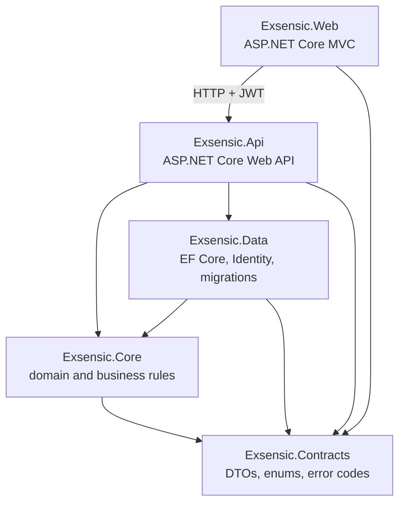
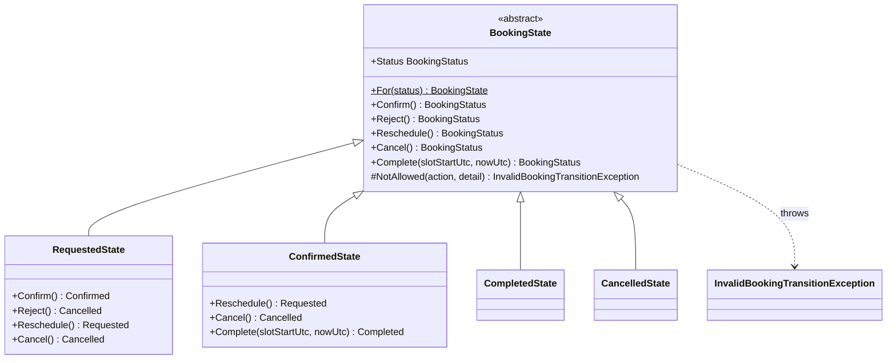

# Architecture and design patterns — Exsensic

How the solution is layered, how a booking's status is controlled, and how errors reach the client.
Owner: Daniel (P2). Names follow docs/CONTRACTS.md exactly.

> Draft. Sections 5–7 (Observer pattern, booking-creation sequence, changes from Part 1) are added
> once the booking endpoints are merged.

## 1. Layered structure

The solution has five projects in `src/` and three in `tests/` (docs/CONTRACTS.md §1). Each layer may
only reference the layers below it, so business rules can't leak into the web front end and the domain
never depends on the database.

| Project | Responsibility | May reference |
|---|---|---|
| `Exsensic.Web` | Screens. Talks to the API over HTTP only | Contracts |
| `Exsensic.Api` | Thin controllers, authentication, error handling | Core, Data, Contracts |
| `Exsensic.Core` | Booking rules: State pattern, validation, services | Contracts |
| `Exsensic.Data` | `ExsensicDbContext`, configurations, migrations, seed | Core, Contracts |
| `Exsensic.Contracts` | The shared names: DTOs, enums, `ErrorCodes` | nothing |

**Proof:** `tests/Exsensic.UnitTests/Architecture/ProjectReferenceTests.cs` reads every `src/*.csproj`
and fails CI if a project gains a reference that isn't in the table above.

Core reaches the database only through the `IAppDbContext` interface, which Data implements. This is
dependency inversion: Core states what it needs, and the API wires in the real database at start-up,
so Core's rules can be unit tested without SQL Server.

## 2. The State pattern: booking status

### Why a pattern

A booking can be in one of four statuses, and each status allows different actions. Written as
`if`/`switch` statements in every service method, these rules would be repeated and easy to get wrong.
The State pattern puts each status's rules in one class, so the full rule set for a status can be read
in one place and a new rule is added in exactly one file.

### The classes

All code is in `src/Exsensic.Core/Bookings/States/`.

- **Safe by default.** Every action on `BookingState` throws `InvalidBookingTransitionException`. A
  status allows only the actions its subclass overrides, so a forgotten case is refused instead of
  silently allowed.
- **Final statuses override nothing.** `CompletedState` and `CancelledState` are empty subclasses, so
  every action on them is refused.
- **States only decide.** Each method returns the next status; it doesn't change the booking. The
  booking's own behaviour methods (`Booking.Behaviour.cs`) apply the result and record a
  `BookingStatusChanged` event, so the status is set in exactly one place in the whole system.
- **No data, one instance each.** States hold no fields, so `BookingState.For(status)` returns a shared
  instance for the booking's current status.

### Transition table

The same table as docs/CONTRACTS.md §3. ✗ means `InvalidBookingTransitionException`, which the API
returns as `409 invalid_transition`.

| From | Confirm | Reject | Reschedule | Cancel | Complete |
|---|---|---|---|---|---|
| Requested | → Confirmed | → Cancelled | stays Requested | → Cancelled | ✗ |
| Confirmed | ✗ | ✗ | → Requested | → Cancelled | → Completed, only after the slot starts |
| Completed | ✗ | ✗ | ✗ | ✗ | ✗ |
| Cancelled | ✗ | ✗ | ✗ | ✗ | ✗ |

Who may perform each action (Admin, owner client, assigned staff) is checked by the API's authorisation
policies before the state is asked; the state only decides whether the action is valid for the status.
The client cancellation cut-off (`BookingPolicy:ClientCancelCutoffHours`) is checked by the booking
service, because admins may cancel at any time.

**Proof:** `tests/Exsensic.UnitTests/Bookings/BookingStateTests.cs` runs one test per cell of the table:
allowed cells return the expected status, forbidden cells throw. Extra tests check that completion is
refused before the slot starts and allowed at the start time.

## 3. Requirement templates and validation

Each `ServiceCategory` has a requirement form defined in code in
`src/Exsensic.Core/Requirements/RequirementTemplates.cs`. The Web renders the form from the template,
and `RequirementValidator` checks submitted answers against the same template, so the form and the
validation can't disagree.

The validator treats the form as untrusted input. It rejects keys that aren't in the template, missing
required answers, select values that aren't one of the options, numbers outside the range, text over the
maximum length, and web addresses that aren't `http` or `https` (which also blocks `javascript:` links).
All errors are returned together, keyed by field, for a `400 validation_failed` response.

**Proof:** `tests/Exsensic.UnitTests/Requirements/RequirementValidatorTests.cs`.

## 4. Error handling

Every error the API returns is an RFC 9457 ProblemDetails body with two extensions: `code` (a value
from `ErrorCodes`, docs/CONTRACTS.md §7) and `traceId` (which links the response to the logs). The Web
reads `code` to choose the message it shows, never the English text.

### How an exception becomes a response

Services throw an exception that describes what went wrong; controllers don't catch anything.
`ProblemDetailsExceptionHandler` (in `src/Exsensic.Api/Errors/`) maps it:

| Exception (in `Exsensic.Core.Exceptions`) | Status | `code` | Message sent |
|---|---|---|---|
| `NotFoundException` | 404 | `not_found` | Always the same generic message |
| `InvalidBookingTransitionException` | 409 | `invalid_transition` | The exception's message |
| `SlotUnavailableException` | 409 | `slot_unavailable` | The exception's message |
| `StaffUnavailableException` | 409 | `staff_unavailable` | The exception's message |
| `ConcurrencyConflictException` | 409 | `concurrency_conflict` | The exception's message |
| `BusinessRuleException` (any other rule, for example `cancel_window_closed`) | 409 | the code it carries | The exception's message |
| Anything else | 500 | `server_error` | Generic message only |

The four specific 409 exceptions inherit from `BusinessRuleException`, so the handler needs one
mapping for all of them, and a new business rule needs no change to the handler.

Responses that don't come from an exception get the same shape:

- Automatic model validation (`[ApiController]`) returns `400` ValidationProblemDetails with per-field
  errors; `code` is added as `validation_failed`.
- Empty `401`, `403`, `404` and `429` responses (from authentication, authorisation, unknown routes and
  rate limiting) are turned into ProblemDetails by the status-code-pages middleware, with the matching code.

### Security decisions

- **No internal details.** For a 500 the client gets a fixed message; the exception and stack trace only
  go to the logs (Application Insights in Azure), found through the `traceId`.
- **404, never 403, for someone else's booking.** The 404 message is identical whether the record is
  missing or belongs to another user, so the API never confirms that a booking exists
  (docs/CONTRACTS.md §12, decision 10).
- **Expected outcomes aren't faults.** 404 and 409 are logged at Information level without the stack
  trace; only 500 is logged as an error. Log messages contain the method, path, status and code, never
  request bodies or personal data.

**Proof:** `tests/Exsensic.IntegrationTests/Errors/ProblemDetailsExceptionHandlerTests.cs` checks every
mapping, the `code` and `traceId` extensions, and that a 500 response contains nothing from the exception.
